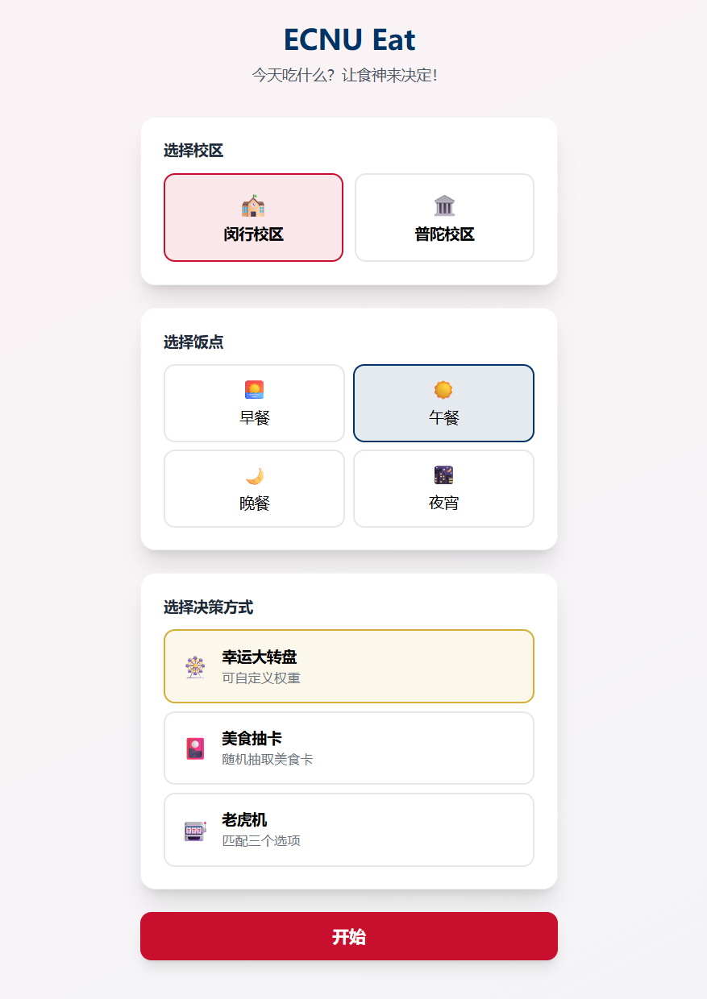
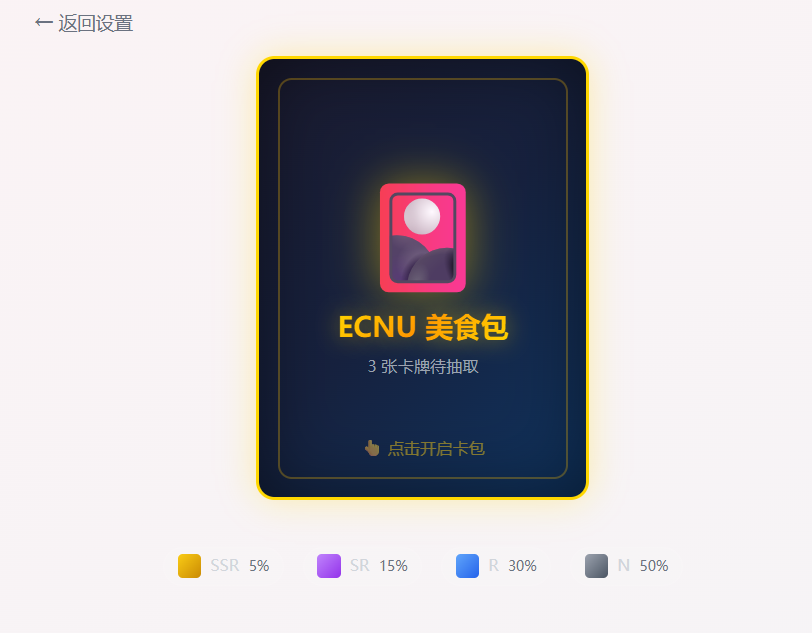
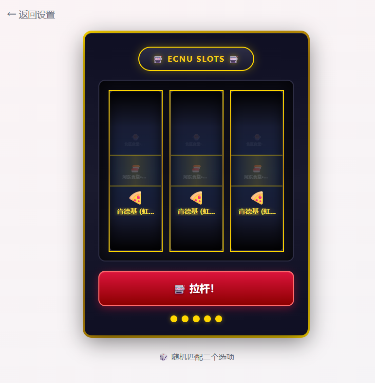
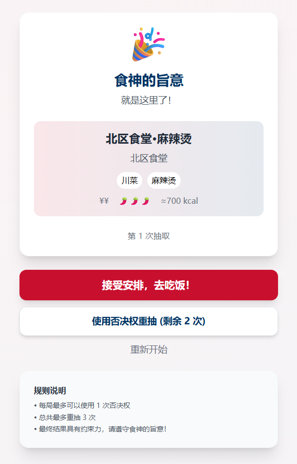

# 🍜 ECNU Eat

> 解决华东师范大学师生「吃什么」世纪难题的游戏化应用

[](https://opensource.org/licenses/MIT)
[](https://react.dev/)
[](https://www.typescriptlang.org/)
[](https://vitejs.dev/)
[](https://tailwindcss.com/)

## ✨ 项目简介

ECNU Eat 是一款为华东师范大学师生设计的美食决策应用。通过游戏化的决策引擎和有趣的交互方式，帮助用户解决「今天吃什么」的选择困难症。

### 🎮 核心功能

| 功能 | 描述 |
|------|------|
| 🎡 **幸运大转盘** | 可视化转盘，支持自定义权重，经典概率决策 |
| 🎴 **美食抽卡** | TCG 卡牌店风格，SSR/SR/R/N 稀有度系统，点击翻牌特效 |
| 🎰 **老虎机** | 吸血鬼幸存者暗黑复古风格，三卷轴匹配体验 |
| ⚙️ **选项池管理** | 自定义餐厅列表、设置权重、排除选项 |
| 🚫 **一票否决权** | 每局可使用一次否决权重新抽取 |
| 🔊 **沉浸式音效** | 三阶段音效系统（开始/旋转/结果），避免听觉疲劳 |

### 🏫 ECNU 专属数据

- 📍 **闵行校区**: 北区、南区、图书馆、河东、河西食堂及周边
- 📍 **普陀校区**: 主校区、西部食堂
- 🍔 周边外卖/餐厅（麦当劳、肯德基等）

## 🚀 在线体验

### 本地开发

```bash
# 克隆仓库
git clone https://github.com/YOUR_USERNAME/ecnu-eat.git
cd ecnu-eat

# 安装依赖
npm install

# 启动开发服务器
npm run dev
```

访问 http://localhost:3000

### 局域网共享

```bash
npm run dev -- --host
```

手机扫码或输入显示的 Network 地址即可访问。

## 📸 截图

### 首页设置

选择校区、饭点和决策方式：

<center></center>

### 决策界面

**幸运大转盘** - 经典转盘，点击可自定义权重

**美食抽卡** - TCG 风格卡包，点击开启 → 点击翻牌

**老虎机** - 暗黑复古风格，三卷轴同时旋转
<center>
  
  
  
</center>

### 结果展示

清晰展示决策结果，支持否决重抽。

<center></center>

## 🛠️ 技术栈

| 技术 | 版本 | 说明 |
|------|------|------|
| React | 19.x | UI 框架 |
| TypeScript | 5.x | 类型安全 |
| Vite | 7.x | 快速构建工具 |
| Tailwind CSS | 3.x | 原子化 CSS 框架 |
| Web Audio API | - | 音效合成（无需外部音频文件） |
| LocalStorage | - | 数据持久化 |

## 📁 项目结构

```
ecnu-eat/
├── src/
│   ├── components/          # React 组件
│   │   ├── decision/        # 决策组件（转盘、抽卡、老虎机）
│   │   ├── layout/          # 布局组件
│   │   └── ui/              # UI 组件
│   ├── data/                # 餐厅数据
│   ├── hooks/               # 自定义 Hooks
│   ├── types/               # TypeScript 类型定义
│   ├── utils/               # 工具函数（音效等）
│   ├── App.tsx              # 主应用
│   ├── main.tsx             # 入口文件
│   └── index.css            # 全局样式
├── public/                  # 静态资源
├── docs/                    # 文档
├── index.html               # HTML 入口
├── package.json
├── tailwind.config.js
├── tsconfig.json
└── vite.config.ts
```

## 📖 使用指南

### 1️⃣ 选择设置

- **校区**: 闵行 / 普陀
- **饭点**: 早餐 / 午餐 / 晚餐 / 夜宵
- **决策方式**: 🎡 大转盘 / 🎴 抽卡 / 🎰 老虎机

### 2️⃣ 管理选项池

- 查看推荐的餐厅列表
- 设置自定义权重（喜欢的餐厅权重更高）
- 排除不想吃的选项

### 3️⃣ 开始决策

- 点击开始按钮
- 享受决策动画和音效
- 查看结果

### 4️⃣ 确认或否决

- ✅ **接受结果**: 确认去吃饭
- 🚫 **使用否决权**: 重新抽取（每局 1 次）
- ⚠️ 达到最大重试次数（3 次）后必须接受

## 🎵 音效系统

采用专业游戏音效设计理念：

| 阶段 | 效果 |
|------|------|
| **Start** | 蓄力上升音 + 低频冲击，按钮反馈 |
| **Spinning** | 木质咔嗒声，模拟指针撞击钉子 |
| **Result** | C大调琶音上行，胜利感满满 |

特色：
- 使用 Web Audio API 实时合成，无需加载音频文件
- 动态音量衰减，避免高频触发时的听觉疲劳
- 低频三角波，偏木质闷一点的点击声

## 🤝 数据贡献

欢迎贡献新的餐厅数据！编辑 `src/data/restaurants.ts` 添加新的餐厅信息。

### 餐厅数据格式

```typescript
{
  id: 'unique-id',           // 唯一标识
  name: '餐厅名称',          // 显示名称
  location: Location,        // 位置对象
  window: '窗口号',          // 可选: 窗口号
  cuisine: ['菜系'],         // 菜系标签
  priceLevel: 1-4,           // 价格等级 (¥ ~ ¥¥¥¥)
  rarity: Rarity.N|R|SR|SSR, // 稀有度
  spicyLevel: 0-3,           // 辣度 (🌶️)
  availableMeals: MealType[],// 供应时段
  isOpen: true,              // 是否营业
  estimatedCalories: 600,    // 预估卡路里
  tags: ['标签'],            // 自定义标签
}
```

## 🗺️ 开发路线图

### ✅ Phase 1 (已完成)

- [x] 基础决策引擎
- [x] 三种决策方式（转盘、抽卡、老虎机）
- [x] 选项池管理
- [x] 否决系统
- [x] 响应式设计
- [x] 游戏化音效系统
- [x] 暗黑复古风格 UI

### 🚧 Phase 2 (计划中)

- [ ] 后端集成 (Supabase)
- [ ] 共享房间功能
- [ ] 多人协同决策
- [ ] 美食集邮册
- [ ] 用户评价系统

### 💡 Future Ideas

- [ ] 营养信息集成
- [ ] 热度推荐算法
- [ ] 随机饭搭子匹配
- [ ] PWA 离线支持

## 📝 开发命令

```bash
# 安装依赖
npm install

# 开发模式
npm run dev

# 类型检查
npm run lint

# 生产构建
npm run build

# 预览构建产物
npm run preview
```

## 📄 许可证

[MIT License](LICENSE) - 可自由使用、修改和分发。

---

**🍜 ECNU Eat - 让每次选择都成为一次冒险！** 🎲

